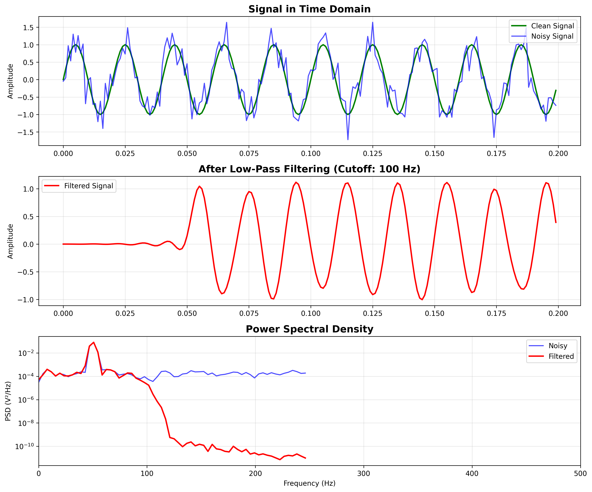
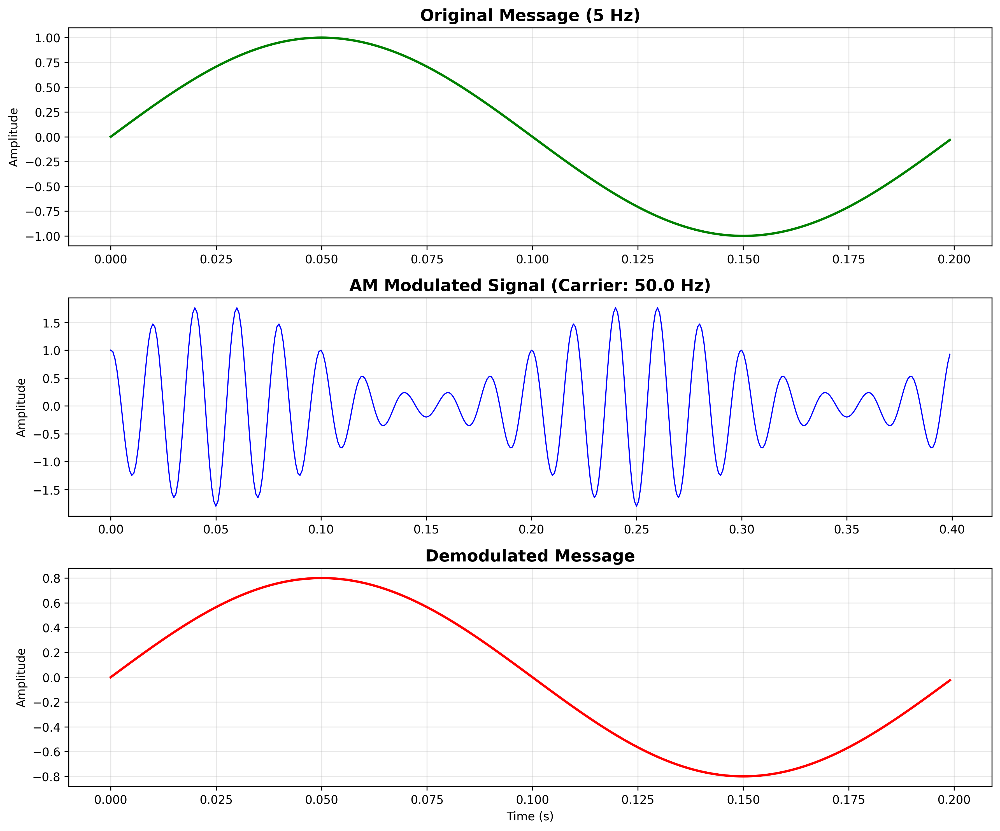
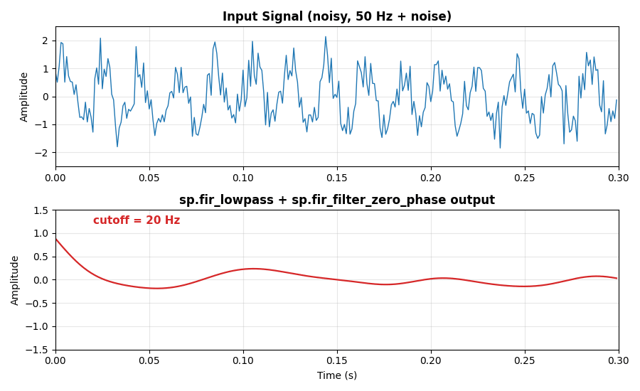
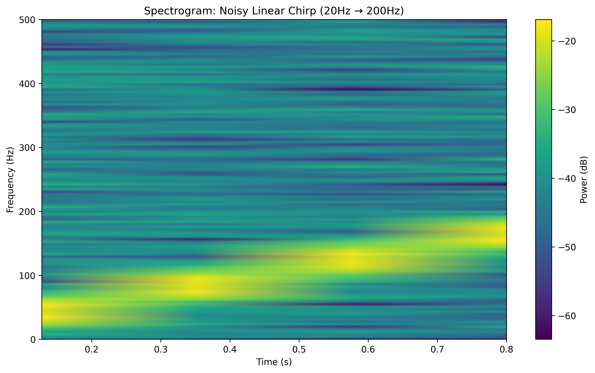
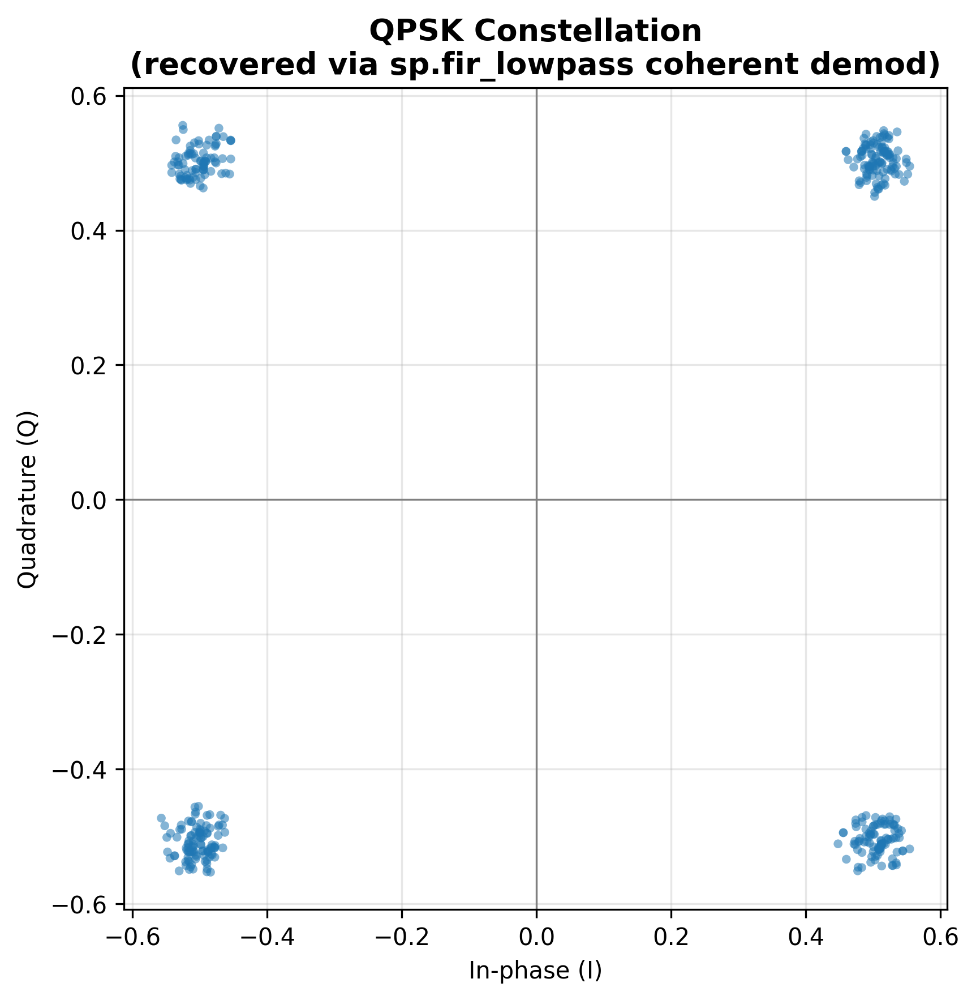
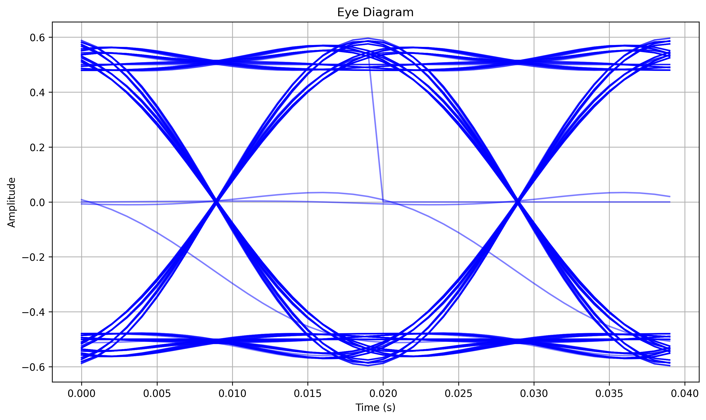
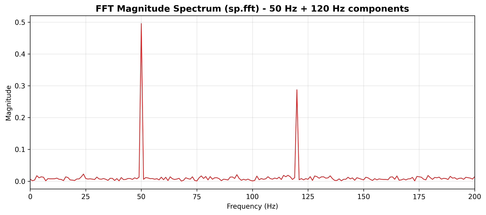
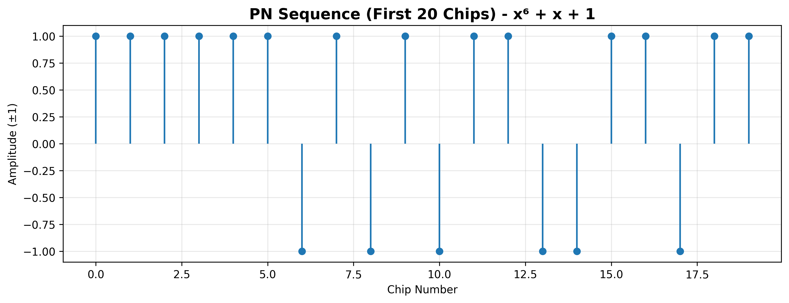

# Signal Processing Toolkit

[](https://opensource.org/licenses/MIT)
[](https://www.python.org/downloads/)
[](https://github.com/SharmaSaurabh-git/signal-processing-toolkit/actions/workflows/ci.yml)
[](https://github.com/SharmaSaurabh-git/signal-processing-toolkit)
[](https://github.com/SharmaSaurabh-git/signal-processing-toolkit/stargazers)

A Python library for signal processing operations commonly used in Electronics and Communication Engineering: FIR filter design, spectral analysis, and analog/digital modulation — built on NumPy and SciPy, with a small set of plotting and signal-generation utilities on top.

## Example Output

### Filter Design & Power Spectral Density





### AM Modulation / Demodulation





### Live Filter Cutoff Sweep





### STFT Spectrogram (Linear Chirp)





### QPSK Constellation (Real Coherent Demodulation)





### Eye Diagram (BPSK)





### FFT Magnitude Spectrum





### PN Sequence (LFSR)




## Features

### Core modules
- **Filters** — FIR filter design (low-pass, high-pass, band-pass, band-stop) via the windowing method, plus causal and zero-phase filtering
- **Transforms** — FFT/IFFT, power spectral density (Welch's method), spectrogram, STFT, coherence, cross-correlation
- **Modulation** — AM/FM analog modulation and demodulation, BPSK/QPSK digital modulation, PN sequence (LFSR) generation
- **Utilities** — test signal generation, time/frequency/spectrogram plotting, SNR calculation, eye diagrams

### Key capabilities
- Parameterizable filter design with customizable windows
- Both causal (`fir_filter`) and zero-phase (`fir_filter_zero_phase`) filtering, so you can pick whichever matches your use case — see [`doc/architecture.md`](doc/architecture.md) for the tradeoff
- Input validation with clear error messages, not silent failures
- 46-test suite covering every public function
- Runnable example scripts under [`signal_processing/examples/`](signal_processing/examples/) and [`demo/`](demo/)

## Installation

```bash
git clone https://github.com/SharmaSaurabh-git/signal-processing-toolkit.git
cd signal-processing-toolkit
pip install -e .
```

Requires Python 3.7+, NumPy, SciPy, and Matplotlib (see [`requirements.txt`](requirements.txt) for versions).

## Quick Start

```python
import numpy as np
import signal_processing as sp

# Generate a noisy test signal
t = np.linspace(0, 1, 1000, endpoint=False)
data = np.sin(2 * np.pi * 50 * t) + 0.5 * np.random.randn(1000)

# Design a low-pass filter (cutoff = 100 Hz)
b, a = sp.fir_lowpass(cutoff=100.0, numtaps=101, fs=1000.0)

# Filter the signal (zero-phase keeps it time-aligned for comparison/plotting)
filtered = sp.fir_filter_zero_phase(data, b, a)

# Analyze the spectrum before and after
freqs, psd = sp.power_spectral_density(data, fs=1000.0, nperseg=256)
filtered_freqs, filtered_psd = sp.power_spectral_density(filtered, fs=1000.0, nperseg=256)

# Plot results
sp.plot_signal(data, fs=1000.0, title="Noisy Signal")
sp.plot_signal(filtered, fs=1000.0, title="Filtered Signal")
sp.plot_spectrum(data, fs=1000.0, title="Signal Spectrum")
sp.plot_spectrum(filtered, fs=1000.0, title="Filtered Spectrum")
```

Every line of this snippet is executed as part of the test/demo suite before each release, so it's guaranteed to run against the current code.

## Documentation

- [API Documentation](doc/api.md) — function reference for every public module
- [Architecture Overview](doc/architecture.md) — package layout, design decisions, known limitations
- [Examples](signal_processing/examples/) — runnable `.py` scripts (`basic_filtering.py`, `comprehensive_demo.py`)
- [Changelog](CHANGELOG.md) — what changed between releases
- [Contributing Guide](CONTRIBUTING.md) — how to contribute

## Examples

```bash
python -m signal_processing.examples.basic_filtering
python -m signal_processing.examples.comprehensive_demo
python demo/generate_demo_plots.py   # saves PNGs to demo/demo_output/
```

## Testing

```bash
pip install -e ".[dev]"
pytest
```

Tests are organized by module (`tests/test_filters.py`, `test_transforms.py`, `test_modulation.py`, `test_utils.py`) and run automatically on every push and pull request via GitHub Actions.

## Contributing

Contributions are welcome! Please read [CONTRIBUTING.md](CONTRIBUTING.md) for the process and code style guidelines.

## License

MIT License — see [LICENSE](LICENSE) for details.

## Acknowledgments

- Inspired by classic DSP textbooks and open-source implementations
- Built with NumPy, SciPy, and Matplotlib
- GitHub Actions for continuous integration
